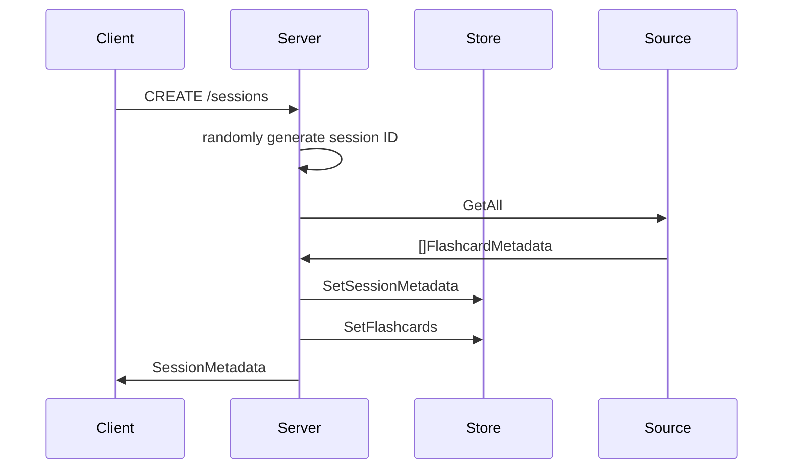
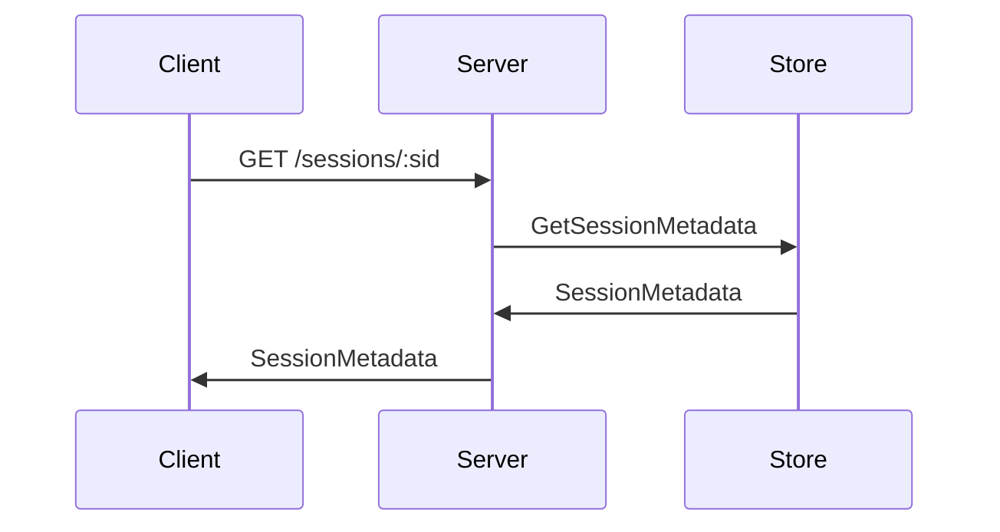
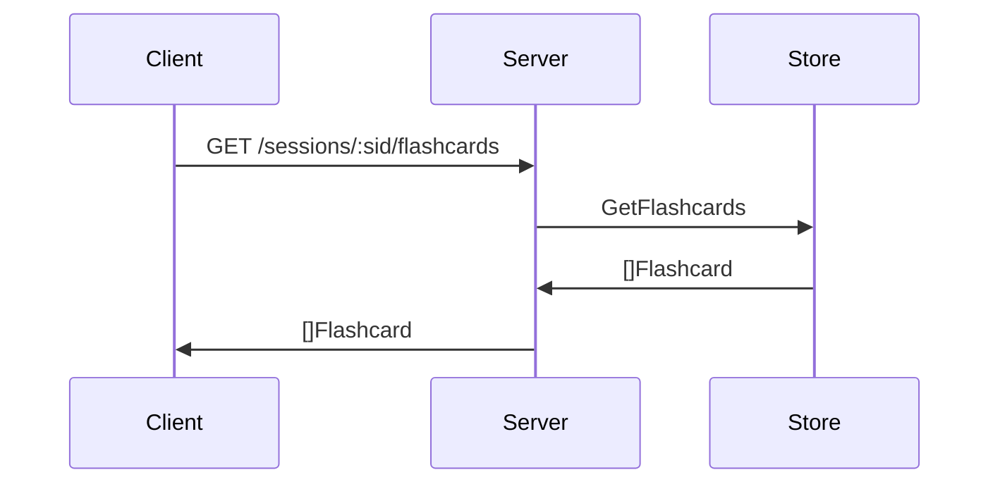
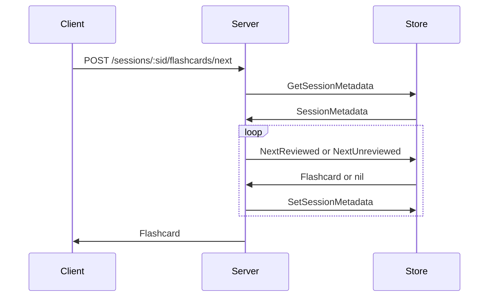
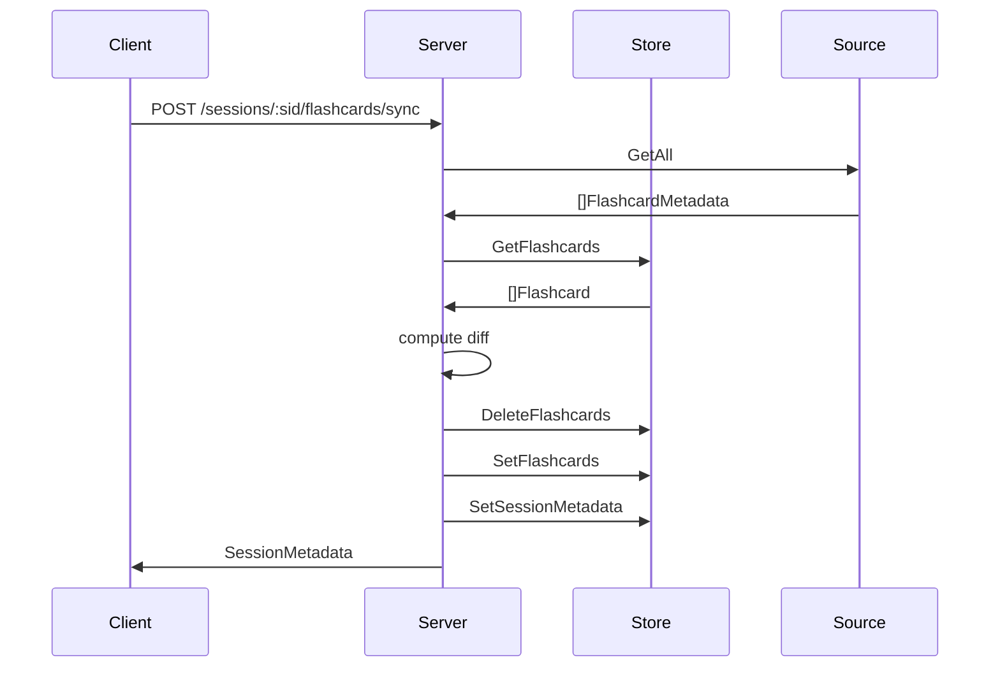
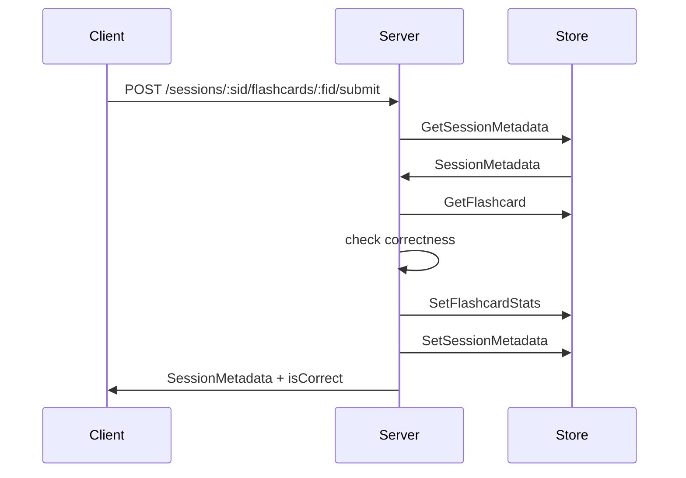
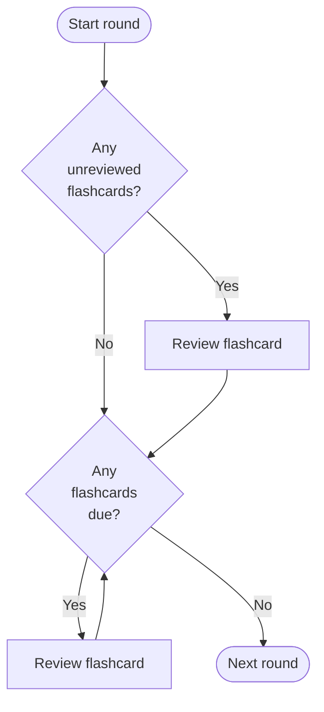

# flashcards

Application for reviewing knowledge.

For a list of available commands, run `make`.

[](https://pkg.go.dev/github.com/lafeingcrokodil/flashcards?tab=doc)
[](https://github.com/lafeingcrokodil/flashcards/actions/workflows/ci.yml)
[](https://goreportcard.com/report/github.com/lafeingcrokodil/flashcards)

## Design

### Components

* `Client` - For example, JavaScript running in a browser.
* `Server` - An HTTP server.
* `Source` - The source of truth for the flashcard metadata, e.g. the prompts and answers.
* `Store` - Stores the review session states.

### Data types

#### SessionMetadata

* `id: string` - Uniquely identifies the session.
* `round: int` - Identifies the current round, starting with 0 and incrementing from there.
* `isNewRound: bool` - True if and only if the round just started, meaning that no flashcards have yet been reviewed in this round.
* `proficiencyCounts: []int` - The number of flashcards at each proficiency level, where a proficiency level corresponds to the number of successful reviews in a row.
* `unreviewedCount: int` - The number of flashcards that haven't been reviewed yet.

#### Flashcard

* `metadata: FlashcardMetadata` - Session-agnostic data like the prompt and answer.
* `stats: FlashcardStats` - Session-specific data like the view count.

#### FlashcardMetadata

* `id: int64` - Uniquely identifies the flashcard.
* `prompt: string` - Text to be shown to the user.
* `context: string` - (Optional) Helps narrow down the possible answers.
* `answer: string` - The accepted answer.

#### FlashcardStats

* `viewCount: int` - The number of times the flashcard has been reviewed.
* `proficiency: int` - The number of successful reviews in a row.
* `nextReview: int` - The round in which the flashcard is due to be reviewed next.

#### Submission

This is the information that would be in the payload for a `POST /sessions/:sid/flashcards/:fid/submit` request.

* `answer: string` - The submitted answer.
* `isFirstGuess: bool` - True if and only if this is the user's first guess, as opposed to a correction following an incorrect guess.

### API

#### CREATE /sessions

Creates and returns a new session. All flashcards will be marked as unreviewed to start with.



#### GET /sessions/:sid

Returns an existing session.



#### GET /sessions/:sid/flashcards

Returns a list of all flashcards.



#### POST /sessions/:sid/flashcards/next

Returns the next flashcard to be reviewed.



#### POST /sessions/:sid/flashcards/sync

Ensures that the session data is up to date with the source of truth for the flashcard metadata.



#### POST /sessions/:sid/flashcards/:fid/submit

Updates the session data based on whether the submitted answer is correct or not, and returns the updated session.



### Algorithm

Each review round has the following logic:



The spaced repetition follows the following logic:

```
if answer is correct:
    schedule next review for 2^proficiency rounds from now
    increment proficiency score
otherwise:
    schedule next review for the next round
    reset proficiency score to 0
```
